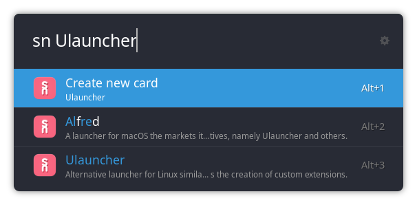

# Ulauncher Supernotes

Simple extension for searching your [Supernotes](https://www.supernotes.app) database and creating new cards from
within [Ulauncher](https://ulauncher.io/).

## Setup

In order to authorize with your Supernotes account, provide a valid API key in this extension's preferences in the
Ulauncher GUI. You can get a key in the Supernotes settings under `API & Integrations --> Manage API Keys`.

In order to be able to add text to your daily notes, go to the extension's preferences and set the field
`Daily notes title`. This will specify the name of the card corresponding to your daily notes. If you leave the field
blank, this feature will be deactivated. The field `Daily notes title` should contain the string `%d`, which will be
replaced with the current date in the style selected in `Daily note date style`.

## Contributing

Contributions of any sorts, pull requests and forks are welcome.

## License

This project is licensed under the terms of the MIT license. See the LICENSE file for details.
